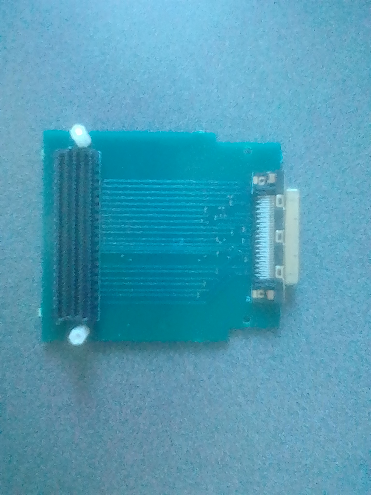

Hardware Setup (Yarr)
=====================================

- For hardware the following pieces are needed
- A KC705 Xilinx Board

.. image:: KC705.jpg
  :width: 384px
  :height: 512px

- A VHDCI to FMC chip

- A VHDCI to Quad DP Rev A. chip

.. image:: DP_simple.jpg
  :width: 384px
  :height: 512px

- The Ohio Multi Chip FMC

.. image:: DP_ohio.jpg
  :width: 384px
  :height: 512px

- Two SMI cables
- A mini-DP to mini-DP cable
- To setup the system, the VHDCI to FMC chip needs to be connect to the VHDCI to Quad DP Rev A. chip and the VHDCI to FMC chip needs to be connected to the FMC LPC connector on the KC705. The mini DP cable needs to be connected to DP3 on the VHDCI to Quad DP Rev A. chip and the two SMI cables need to be connected to USERCLK N/P on the board and transmitting a 156.25 clk. 
- A block diagram of the hardware setup can be seen below.

.. image:: hardware_setup.png 
