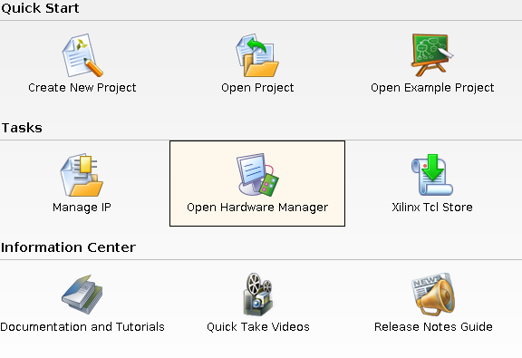
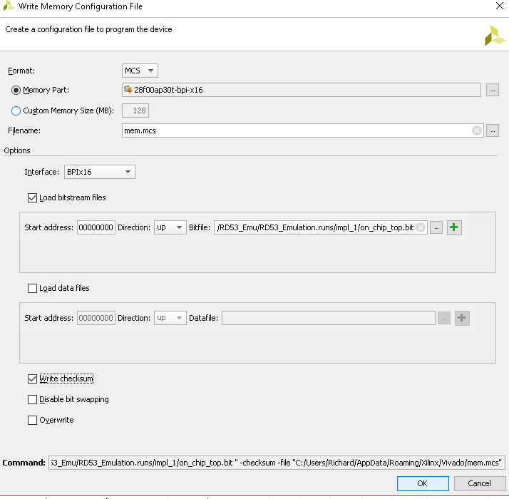
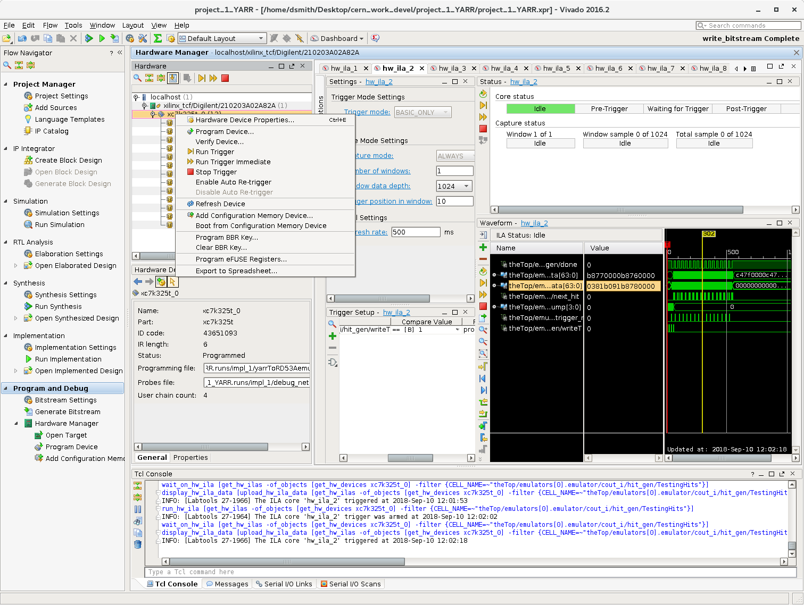
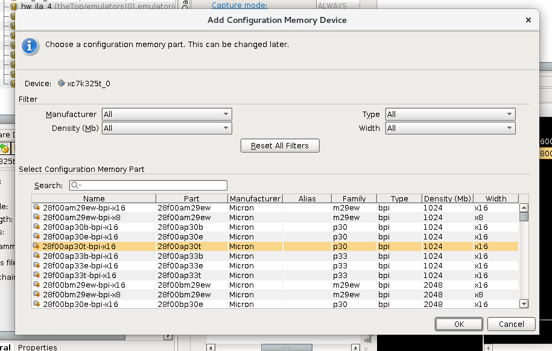

Software Setup
=====================================

- Follow the following steps to setup the software part of the system.

- 1: First open Vivavo and then the Open Hardware Manger.

- 2: Connect the PC to the board using either the JTAG debugger or the mini-usb cable. Then select auto-connect.

.. image:: flash_step_2.png

- 2a: If you want to program the KC705 right click on xc7k325_0 and hit program. If you want to flash the memory on the KC705 continue through the instructions.
- 2b: If you want to generate your own memory files, click on tools, then generate memory device. Then choose the settings as shown in the picture.

- 3: Right click on xc7k325_0 and select add memory configuration device.

- 4: In the pop up menu choose the 28f00ap30t-bpi-x16 memory and hit ok.

- 5: Then load the configuration file and prm file located in the folder RD53A_emulator/RD53A_Emulator folder.
- 6: Then check the verify checksum option and hit ok.

.. image:: flash_step_5.png

- 7: When the memory is finished loaded reboot your PC and the system should be good to go.
- 8: If the system doesn't work at first try pushing the reset button (Center button for KC705) to insure the system is properly initialized.
