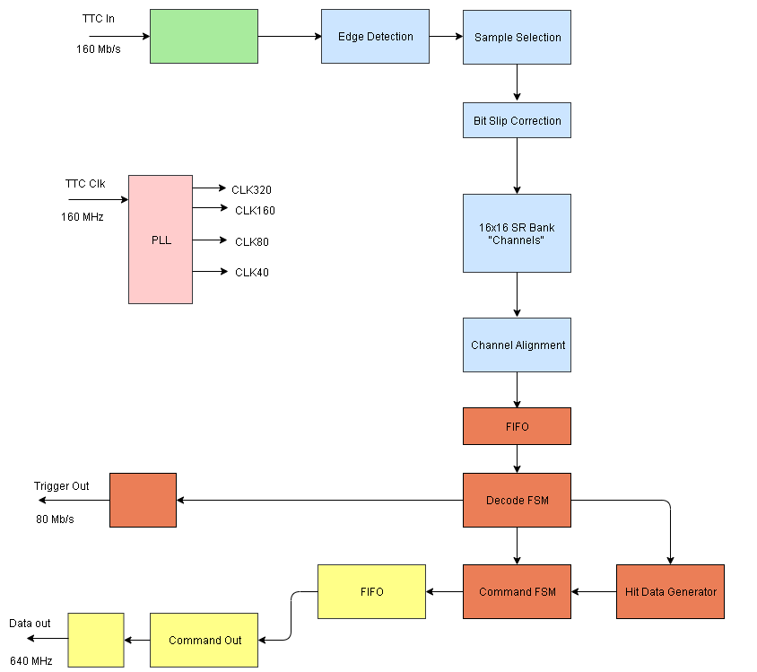

Welcome to rd53a_emulator documentation!
========================================

Guide
^^^^^
.. toctree::
   :maxdepth: 3
    
   HardwareSetupYarr
   SoftwareSetupYarr
   RCESetup
   UsageExamples

Contributors
^^^^^^^^^^^^
* Douglas Smith (smithd57@uw.edu)
* Dustin Werran (werrand@uw.edu) 
* Lev Kurilenko
* Logan Adams
* Joe Mayer 

Build Info
^^^^^^^^^^
- Targets Xilinx KC705 Kintex FPGA Board 
- Vivado 2016.2

Description
^^^^^^^^^^^
- This is a firmware RD53A emulator (code located here https://gitlab.cern.ch/dgsmith/rd53a_hardware_emulator). The emulator has currently been set up to communicate properly with the YARR firmware (located here https://github.com/Yarr/Yarr-fw). 
- A 160 MHz output version of the emulator has also been designed to setup communication between the RD53A emulator and the RCE-RD53A projetc at SLAC (the code for this can also be found at the link above.) 
- Information on the installation of YARR and using YARR can be found here https://yarr.readthedocs.io/en/latest/.
- A block diagram of the system can be seen below.

Current Features/Non-features
^^^^^^^^^^^^^^^^^^^^^^^^^^^^^
- The main pieces of currently working functionality are listed below.
- Reading and writing of global registers. The read out registers are sent through lane 0. 
- Trigger commands will output clumps of trigger data. The trigger data that currently creates comes out a checkboard pattern.
- ECR, BCR, and CAL commands are received by the system though currently have no external impact.

- The main non-features are listed below. 
- Since this is a digital design project any RD53A features that involve analog circuitry such as the pixels have been greatly simplified or removed entirely. 
- An example of a simplification is that the pixel data outputted by triggers is the result of random number generators and/or standarized data formats not produced by an emulation of individual pixels. Examples of analog features that have been removed include pixel calibration injection as well as the mechanics that allow the user to read/write to pixel registers. 
- As stated above ECR, BCR, and CAL commands are received by the system though currently have no external impact.

Planned Features/Updates
^^^^^^^^^^^^^^^^^^^^^^^^
- The currently planned updates and upgrades to the system are listed below
- An overhaul of the trigger system that will make the system produce data that is closer to real pixel data.
- Developing compatibility with the RCE-RD53A project.
- Developing compatiblity with the FELIX project. 

